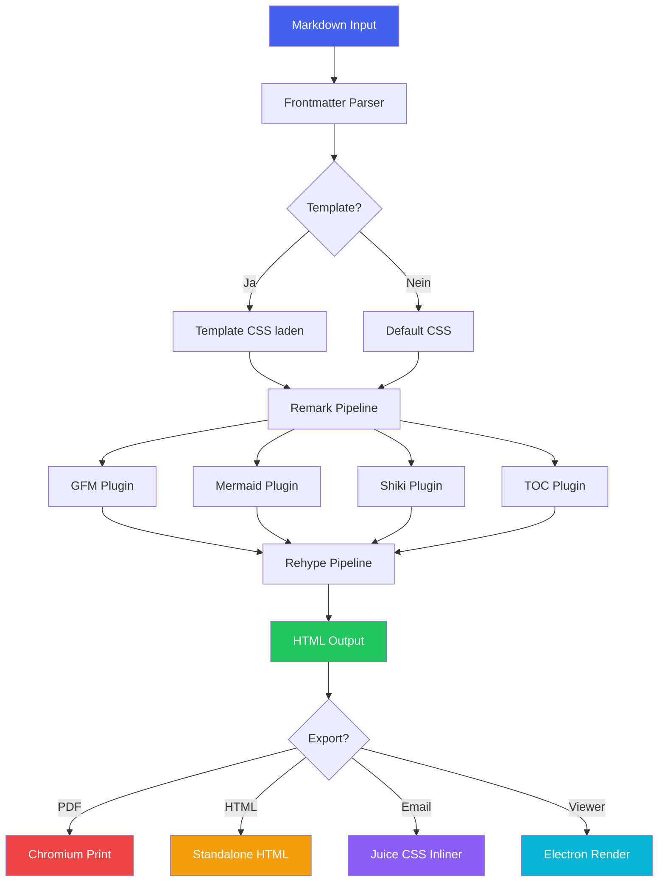
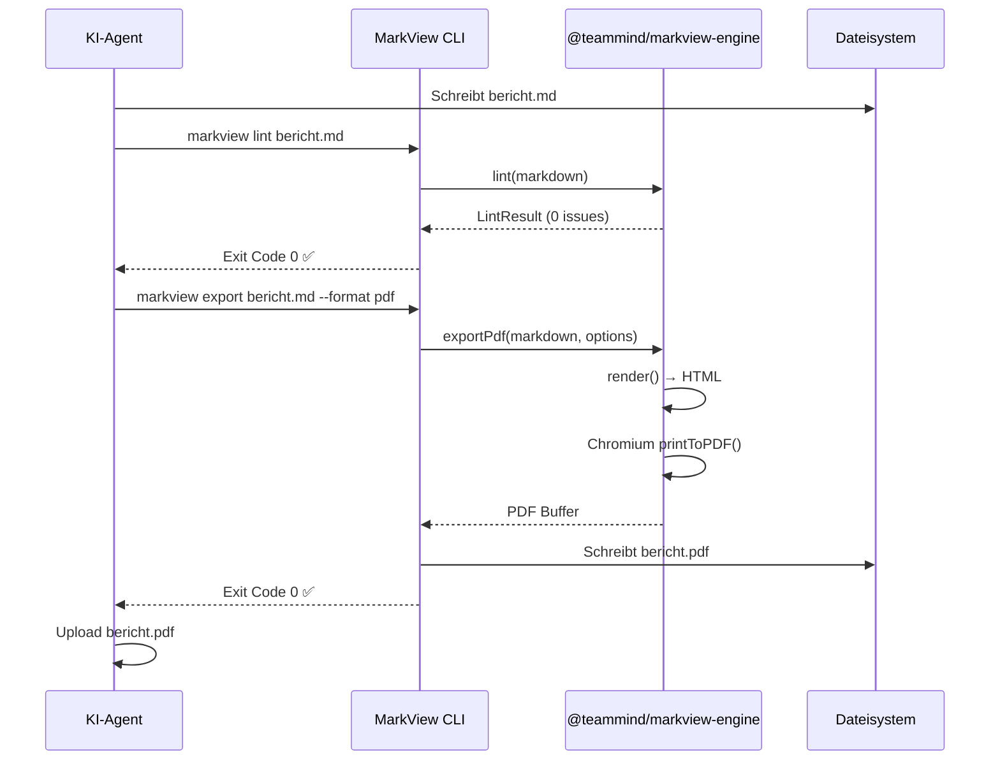
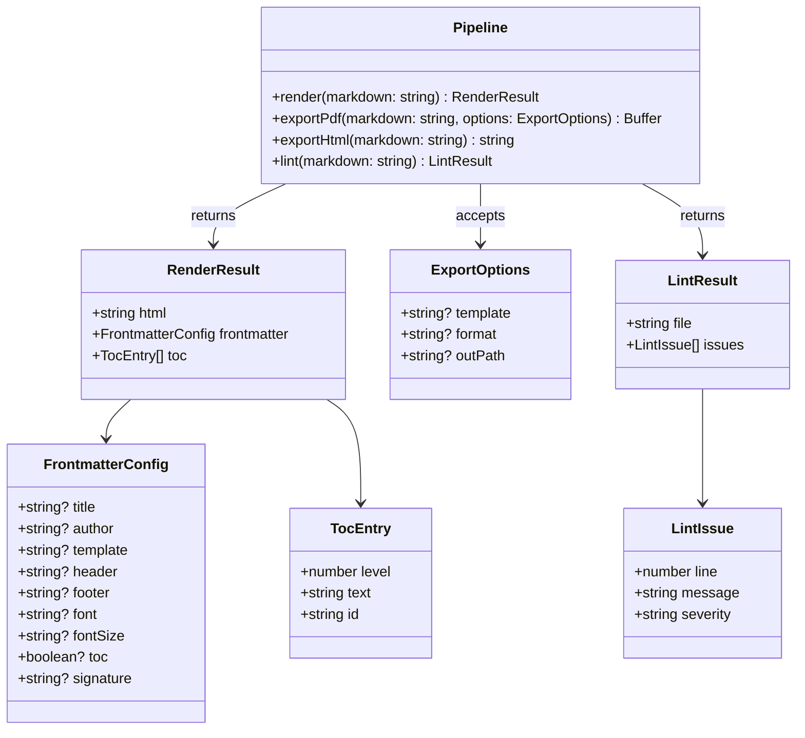
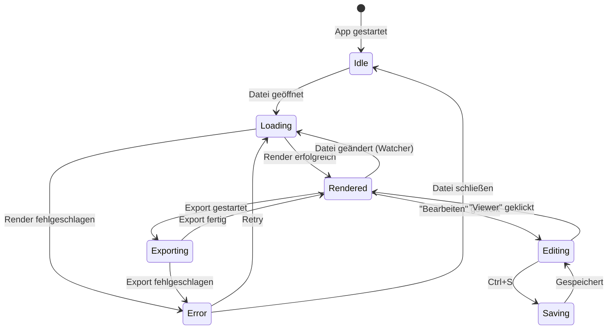
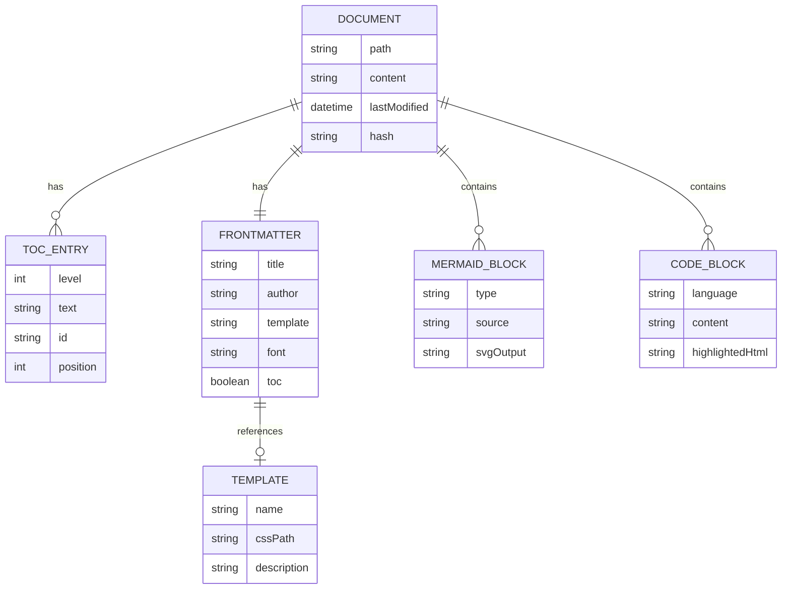
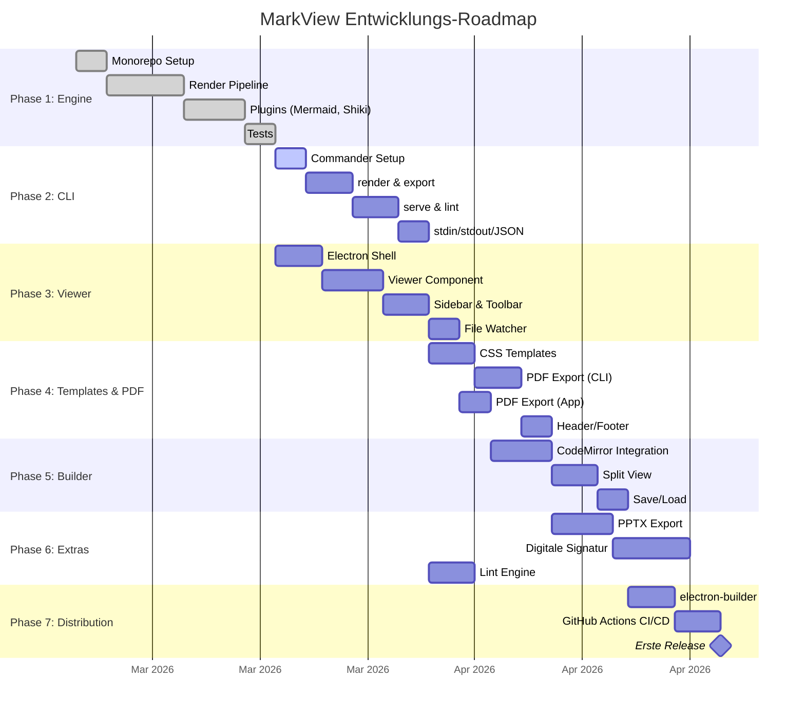
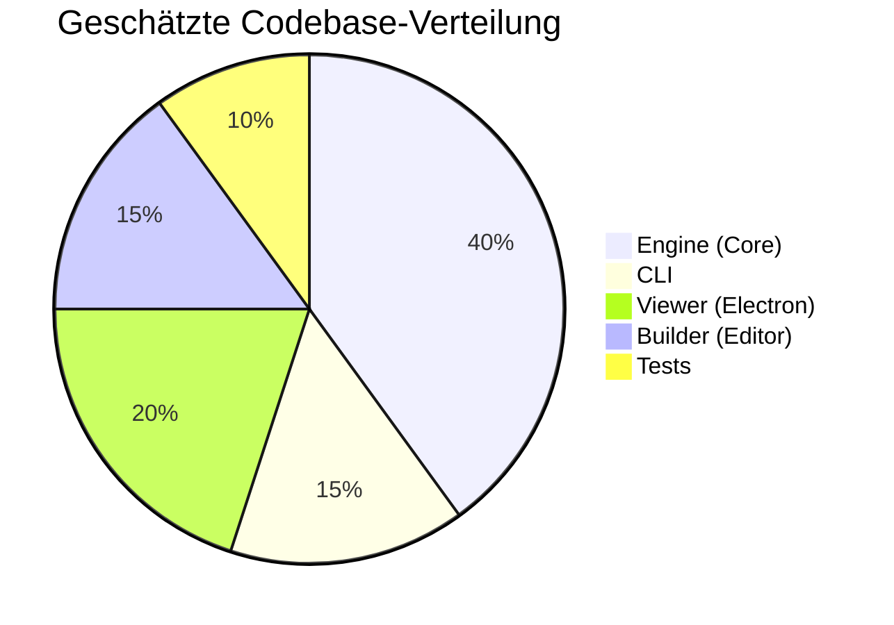
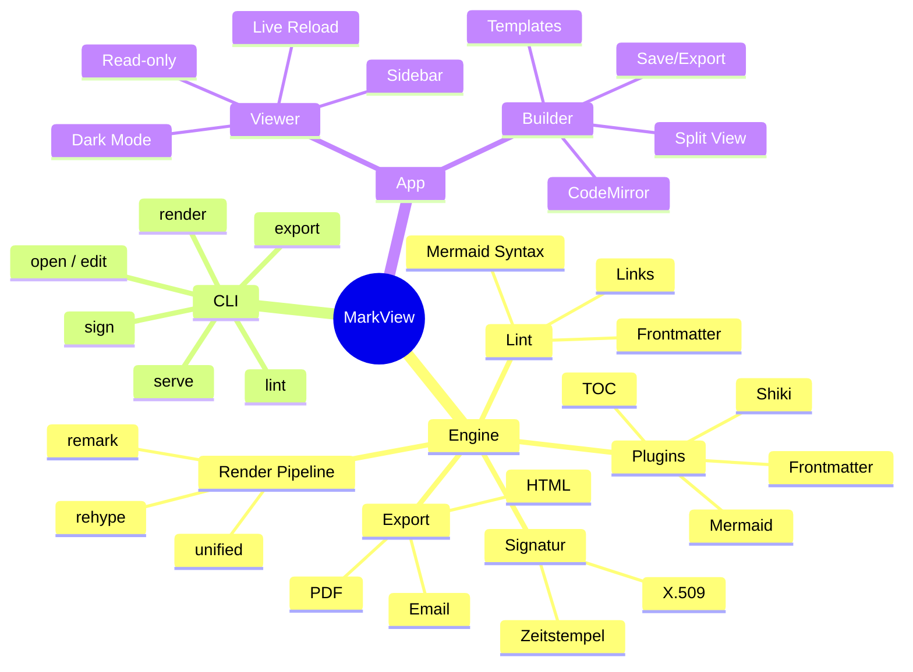
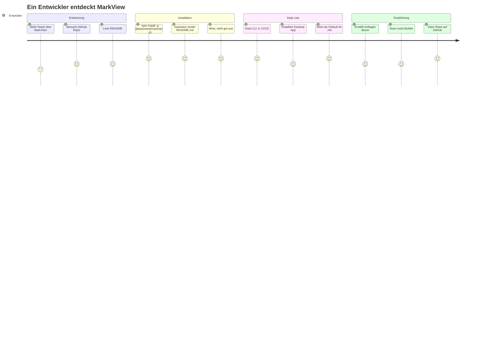

# TeamMind MarkView — Vollständiges Testdokument

> Dieses Dokument testet **jedes Feature**, das der TeamMind MarkView Viewer beherrschen muss.
> Wenn alles korrekt gerendert wird, ist der Viewer produktionsreif.
>
> Erstellt von **{{company}}** für **{{product}}** v{{version}}.
> Wörter: {{wordcount}} | Lesezeit: {{readtime}} | Datum: {{date:long}}

---

## Inhaltsübersicht

- [1. Typografie & Textformatierung](#1-typografie--textformatierung)
- [2. Listen & Aufzählungen](#2-listen--aufzählungen)
- [3. Tabellen](#3-tabellen)
- [4. Code & Syntax Highlighting](#4-code--syntax-highlighting)
- [5. Mermaid-Diagramme](#5-mermaid-diagramme)
- [6. Blockquotes & Callouts](#6-blockquotes--callouts)
- [7. Links, Bilder & Medien](#7-links-bilder--medien)
- [8. Mathematik & Formeln](#8-mathematik--formeln)
- [9. Footnotes & Referenzen](#9-footnotes--referenzen)
- [10. Horizontale Regeln & Trenner](#10-horizontale-regeln--trenner)
- [11. Verschachtelte Strukturen](#11-verschachtelte-strukturen)
- [12. Edge Cases & Stresstests](#12-edge-cases--stresstests)

---

## 1. Typografie & Textformatierung

### Basis-Formatierung

Das ist **fetter Text** und das ist *kursiver Text*. Kombiniert: ***fett und kursiv***. Das ist ~~durchgestrichen~~. Und hier ist `inline code` mitten im Satz.

### Überschriften-Hierarchie

# Heading 1 — Der Haupttitel
## Heading 2 — Kapitel
### Heading 3 — Abschnitt
#### Heading 4 — Unterabschnitt
##### Heading 5 — Detail
###### Heading 6 — Feinste Ebene

### Absätze & Zeilenumbrüche

Erster Absatz mit etwas längerem Text, um zu testen wie der Viewer mit Fließtext umgeht. Lorem ipsum dolor sit amet, consectetur adipiscing elit. Sed do eiusmod tempor incididunt ut labore et dolore magna aliqua. Ut enim ad minim veniam, quis nostrud exercitation ullamco laboris.

Zweiter Absatz, getrennt durch eine Leerzeile. Der Abstand zwischen Absätzen sollte visuell klar erkennbar sein, aber nicht zu groß — typisch 0.5–1em Abstand.

Dieser Satz hat einen  
manuellen Zeilenumbruch (zwei Leerzeichen + Enter).

### Spezielle Textauszeichnungen

- Subscript: H~2~O (falls unterstützt)
- Superscript: E = mc^2^ (falls unterstützt)
- Markierung: ==hervorgehobener Text== (falls unterstützt)
- Tastenkombinationen: <kbd>Ctrl</kbd> + <kbd>Shift</kbd> + <kbd>P</kbd>
- Abkürzungen: HTML, CSS, API

---

## 2. Listen & Aufzählungen

### Ungeordnete Liste

- Erster Punkt
- Zweiter Punkt mit **Formatierung**
- Dritter Punkt
  - Verschachtelt Ebene 2
  - Noch ein Punkt
    - Verschachtelt Ebene 3
    - Tiefste sinnvolle Ebene
  - Zurück auf Ebene 2
- Zurück auf Ebene 1

### Geordnete Liste

1. Ersten Schritt ausführen
2. Zweiten Schritt ausführen
3. Dritten Schritt ausführen
   1. Unter-Schritt A
   2. Unter-Schritt B
      1. Detail I
      2. Detail II
   3. Unter-Schritt C
4. Vierten Schritt ausführen

### Gemischte Liste

1. **Installation**
   - Node.js 20+ installieren
   - `pnpm install -g @teammind/markview-cli`
2. **Konfiguration**
   - Frontmatter in `.md` Datei erstellen
   - Template wählen: `default`, `report`, `minimal`
3. **Verwendung**
   - `markview render datei.md`
   - `markview export datei.md --format pdf`

### Task-Liste (GFM)

- [x] Monorepo aufsetzen
- [x] Render Engine implementieren
- [x] CLI Package erstellen
- [x] Electron Viewer bauen
- [x] Builder / Editor entwickeln
- [x] TTS Integration (Speaklone)
- [x] Email Export
- [x] Digitale Signatur (PoC)
- [ ] Distribution & CI/CD

### Definitionsliste (falls unterstützt)

Markdown
: Eine leichtgewichtige Auszeichnungssprache für formatierte Texte.

Mermaid
: Eine JavaScript-basierte Diagramm- und Visualisierungssprache.

Frontmatter
: YAML-Metadaten am Anfang einer Markdown-Datei.

---

## 3. Tabellen

### Einfache Tabelle

| Feature | Status | Priorität |
|---------|--------|-----------|
| Viewer | ✅ Fertig | Hoch |
| Builder | 🚧 In Arbeit | Hoch |
| CLI | ✅ Fertig | Hoch |
| Signatur | ⏳ Geplant | Mittel |

### Tabelle mit Ausrichtung

| Links | Zentriert | Rechts | Standard |
|:------|:---------:|-------:|----------|
| Text | Text | 1.234 | Text |
| Längerer Text | Kurz | 42 | Daten |
| ABC | XYZ | 999.999 | Test |

### Große Tabelle

| ID | Name | Rolle | Team | Standort | Status | Letzter Login | Projekte |
|----|------|-------|------|----------|--------|---------------|----------|
| 001 | Anna Müller | Lead Engineer | Platform | Berlin | Aktiv | 2026-03-09 | MarkView, Core |
| 002 | Ben Schmidt | Senior Dev | Frontend | München | Aktiv | 2026-03-08 | Builder, UI |
| 003 | Clara Weber | DevOps | Infrastructure | Hamburg | Aktiv | 2026-03-09 | CI/CD, Deploy |
| 004 | David Koch | Designer | Product | Berlin | Urlaub | 2026-03-01 | Templates |
| 005 | Eva Fischer | QA Engineer | Quality | Remote | Aktiv | 2026-03-09 | Testing |
| 006 | Frank Bauer | Backend Dev | Platform | Wien | Aktiv | 2026-03-07 | Engine, API |
| 007 | Greta Hoffmann | PM | Product | Berlin | Aktiv | 2026-03-09 | Roadmap |
| 008 | Hans Richter | Security | Infrastructure | Zürich | Aktiv | 2026-03-09 | Signatur |

### Tabelle mit Formatierung

| Befehl | Beschreibung | Beispiel |
|--------|-------------|---------|
| `markview render` | Rendert Markdown zu **HTML** | `markview render README.md` |
| `markview export` | Exportiert zu *verschiedenen* Formaten | `markview export doc.md --format pdf` |
| `markview serve` | Startet einen ~~einfachen~~ **lokalen** Server | `markview serve ./docs/` |
| `markview lint` | Validiert Markdown-Dateien | `markview lint *.md --strict` |

---

## 4. Code & Syntax Highlighting

### Inline Code

Nutze `npm install -g @teammind/markview-cli` zur Installation. Die Config liegt in `~/.markviewrc`.

### JavaScript / TypeScript

```typescript
import { render, exportPdf, lint } from '@teammind/markview-engine';
import type { RenderResult, ExportOptions } from '@teammind/markview-engine';

interface ViewerConfig {
  theme: 'light' | 'dark' | 'system';
  fontSize: number;
  lineHeight: number;
  sidebarVisible: boolean;
}

async function processDocument(
  markdown: string,
  config: ViewerConfig
): Promise<RenderResult> {
  const result = await render(markdown);
  
  if (result.frontmatter.template) {
    console.log(`Template: ${result.frontmatter.template}`);
  }

  // TOC mit mehr als 3 Einträgen → Sidebar automatisch öffnen
  if (result.toc.length > 3 && !config.sidebarVisible) {
    config.sidebarVisible = true;
  }

  return result;
}

// Pipeline: Render → Lint → Export
const pipeline = async (files: string[]) => {
  for (const file of files) {
    const md = await Bun.file(file).text();
    const issues = await lint(md);
    
    if (issues.length === 0) {
      const pdf = await exportPdf(md, { 
        template: 'report',
        format: 'A4' 
      });
      await Bun.write(file.replace('.md', '.pdf'), pdf);
    }
  }
};
```

### Python

```python
from dataclasses import dataclass
from pathlib import Path
from typing import Optional
import subprocess
import json

@dataclass
class MarkViewResult:
    html: str
    frontmatter: dict
    toc: list[dict]
    
    @property
    def title(self) -> Optional[str]:
        return self.frontmatter.get('title')

class MarkViewAgent:
    """Ein KI-Agent der MarkView CLI nutzt."""
    
    def __init__(self, binary: str = "markview"):
        self.binary = binary
    
    def render(self, path: Path) -> MarkViewResult:
        result = subprocess.run(
            [self.binary, "render", str(path), "--json"],
            capture_output=True, text=True
        )
        data = json.loads(result.stdout)
        return MarkViewResult(**data)
    
    def export_pdf(self, path: Path, template: str = "default") -> Path:
        output = path.with_suffix('.pdf')
        subprocess.run([
            self.binary, "export", str(path),
            "--format", "pdf",
            "--template", template,
            "-o", str(output)
        ], check=True)
        return output
    
    def lint(self, path: Path, strict: bool = False) -> list[dict]:
        cmd = [self.binary, "lint", str(path), "--json"]
        if strict:
            cmd.append("--strict")
        result = subprocess.run(cmd, capture_output=True, text=True)
        return json.loads(result.stdout).get("issues", [])


# Verwendung durch einen Agenten
agent = MarkViewAgent()
doc = Path("bericht.md")

issues = agent.lint(doc, strict=True)
if not issues:
    pdf = agent.export_pdf(doc, template="report")
    print(f"PDF erstellt: {pdf}")
```

### Rust

```rust
use std::path::PathBuf;
use serde::{Deserialize, Serialize};

#[derive(Debug, Serialize, Deserialize)]
struct FrontmatterConfig {
    title: Option<String>,
    author: Option<String>,
    template: Option<String>,
    toc: Option<bool>,
}

#[derive(Debug)]
struct RenderResult {
    html: String,
    frontmatter: FrontmatterConfig,
    toc: Vec<TocEntry>,
}

#[derive(Debug)]
struct TocEntry {
    level: u8,
    text: String,
    id: String,
}

fn render(markdown: &str) -> Result<RenderResult, Box<dyn std::error::Error>> {
    let frontmatter = parse_frontmatter(markdown)?;
    let html = render_to_html(markdown)?;
    let toc = extract_toc(&html)?;
    
    Ok(RenderResult { html, frontmatter, toc })
}

fn main() {
    let path = PathBuf::from("README.md");
    let content = std::fs::read_to_string(&path).expect("Datei nicht gefunden");
    
    match render(&content) {
        Ok(result) => {
            println!("Titel: {:?}", result.frontmatter.title);
            println!("TOC Einträge: {}", result.toc.len());
        }
        Err(e) => eprintln!("Fehler: {}", e),
    }
}
```

### Shell / Bash

```bash
#!/bin/bash
set -euo pipefail

# MarkView CI/CD Pipeline
DOCS_DIR="./docs"
BUILD_DIR="./build/pdfs"
TEMPLATE="report"

echo "🔍 Linting Markdown files..."
markview lint "$DOCS_DIR"/*.md --strict

if [ $? -ne 0 ]; then
    echo "❌ Lint-Fehler gefunden. Abbruch."
    exit 1
fi

echo "📄 Exportiere PDFs..."
mkdir -p "$BUILD_DIR"
markview export "$DOCS_DIR"/*.md \
    --format pdf \
    --template "$TEMPLATE" \
    --outdir "$BUILD_DIR"

echo "✅ $(ls -1 "$BUILD_DIR"/*.pdf | wc -l) PDFs generiert."

# Optional: Upload
if [ "${UPLOAD:-false}" = "true" ]; then
    echo "☁️  Uploading to S3..."
    aws s3 sync "$BUILD_DIR" s3://docs-bucket/pdfs/
fi
```

### CSS

```css
/* MarkView Default Template */
:root {
  --mv-font: 'Inter', -apple-system, BlinkMacSystemFont, sans-serif;
  --mv-mono: 'JetBrains Mono', 'Fira Code', monospace;
  --mv-bg: #ffffff;
  --mv-text: #1a1a2e;
  --mv-accent: #4361ee;
  --mv-border: #e2e8f0;
  --mv-code-bg: #f8fafc;
  --mv-blockquote: #6366f1;
}

[data-theme="dark"] {
  --mv-bg: #0f172a;
  --mv-text: #e2e8f0;
  --mv-accent: #818cf8;
  --mv-border: #334155;
  --mv-code-bg: #1e293b;
  --mv-blockquote: #a5b4fc;
}

.markview-document {
  font-family: var(--mv-font);
  font-size: 11pt;
  line-height: 1.6;
  color: var(--mv-text);
  background: var(--mv-bg);
  max-width: 800px;
  margin: 0 auto;
  padding: 2rem;
}

.markview-document h1 {
  font-size: 2em;
  font-weight: 700;
  border-bottom: 2px solid var(--mv-accent);
  padding-bottom: 0.3em;
  margin-top: 1.5em;
}

@media print {
  .markview-document {
    max-width: none;
    padding: 0;
  }
  
  @page {
    margin: 2cm;
    @top-center { content: var(--mv-header); }
    @bottom-center { content: "Seite " counter(page) " von " counter(pages); }
  }
}
```

### JSON

```json
{
  "name": "@teammind/markview-engine",
  "version": "0.1.0",
  "type": "module",
  "main": "./dist/index.js",
  "types": "./dist/index.d.ts",
  "exports": {
    ".": {
      "import": "./dist/index.js",
      "require": "./dist/index.cjs",
      "types": "./dist/index.d.ts"
    }
  },
  "scripts": {
    "build": "tsup src/index.ts --format esm,cjs --dts",
    "test": "vitest run",
    "dev": "tsup src/index.ts --watch"
  },
  "dependencies": {
    "unified": "^11.0.0",
    "remark-parse": "^11.0.0",
    "remark-gfm": "^4.0.0",
    "mermaid": "^11.0.0",
    "shiki": "^1.0.0",
    "gray-matter": "^4.0.0"
  }
}
```

### YAML

```yaml
# electron-builder.yml
appId: eu.team-mind.markview
productName: TeamMind MarkView
copyright: Copyright © 2026 Digitale Projekte RF GmbH

directories:
  output: dist
  buildResources: resources

files:
  - "dist/**/*"
  - "package.json"

fileAssociations:
  - ext: md
    name: Markdown Document
    description: Markdown-Dokument
    mimeType: text/markdown
    role: Viewer

mac:
  category: public.app-category.developer-tools
  icon: resources/icons/icon.icns
  target:
    - dmg
    - zip

win:
  icon: resources/icons/icon.ico
  target:
    - nsis
    - portable

linux:
  icon: resources/icons
  category: Development
  target:
    - AppImage
    - deb
    - rpm
  mimeTypes:
    - text/markdown
```

### Diff

```diff
--- a/packages/engine/src/pipeline.ts
+++ b/packages/engine/src/pipeline.ts
@@ -12,6 +12,7 @@ import { remarkMermaid } from './plugins/mermaid';
 import { remarkToc } from './plugins/toc';
+import { remarkHighlight } from './plugins/highlight';

 export async function render(markdown: string): Promise<RenderResult> {
   const result = await unified()
     .use(remarkParse)
     .use(remarkGfm)
     .use(remarkFrontmatter)
     .use(remarkMermaid)
+    .use(remarkHighlight)
     .use(remarkRehype, { allowDangerousHtml: true })
     .use(rehypeStringify)
     .process(markdown);
```

---

## 5. Mermaid-Diagramme

### Flowchart — MarkView Render Pipeline



### Sequenzdiagramm — Agent nutzt CLI



### Class Diagram — Engine Architektur



### State Diagram — Viewer App States



### Entity Relationship — Datenmodell



### Gantt Chart — Roadmap



### Pie Chart — Codebase Verteilung (Schätzung)



### Git Graph — Release-Strategie

```mermaid
gitgraph
    commit id: "init"
    commit id: "monorepo setup"
    
    branch feature/engine
    commit id: "pipeline"
    commit id: "plugins"
    commit id: "tests"
    checkout main
    merge feature/engine id: "v0.1.0-engine"
    
    branch feature/cli
    commit id: "commands"
    commit id: "serve"
    commit id: "lint"
    checkout main
    
    branch feature/viewer
    commit id: "electron shell"
    commit id: "viewer component"
    checkout main
    merge feature/cli id: "v0.1.0-cli"
    merge feature/viewer id: "v0.1.0-app"
    
    branch feature/builder
    commit id: "editor"
    commit id: "split view"
    checkout main
    merge feature/builder id: "v0.2.0-app"
    
    commit id: "v1.0.0" type: HIGHLIGHT
```

### Mindmap — Feature-Übersicht



### User Journey — Erster Kontakt mit MarkView



---

## 6. Blockquotes & Callouts

### Einfaches Blockquote

> Dies ist ein einfaches Blockquote.
> Es kann mehrere Zeilen umfassen.

### Verschachteltes Blockquote

> Erste Ebene des Zitats.
>
> > Zweite Ebene — ein Zitat im Zitat.
> >
> > > Dritte Ebene — maximale Verschachtelung.
>
> Zurück auf der ersten Ebene.

### Blockquote mit Formatierung

> **Wichtig:** Der Viewer muss Blockquotes mit voller Formatierung unterstützen:
>
> - Listen innerhalb von Quotes
> - `Code` innerhalb von Quotes
> - *Kursiver* und **fetter** Text
>
> ```javascript
> // Sogar Code-Blöcke in Blockquotes
> const x = "Das muss funktionieren";
> ```
>
> | Auch | Tabellen |
> |------|----------|
> | in   | Quotes   |

### GitHub-Style Alerts (falls unterstützt)

> [!NOTE]
> Dies ist eine Information. Der Viewer sollte dies visuell hervorheben.

> [!TIP]
> Ein hilfreicher Tipp für den Nutzer.

> [!IMPORTANT]
> Wichtige Information, die nicht übersehen werden darf.

> [!WARNING]
> Warnung vor möglichen Problemen.

> [!CAUTION]
> Kritische Warnung — hier droht Datenverlust.

---

## 7. Links, Bilder & Medien

### Links

- Inline-Link: [MarkView auf GitHub](https://github.com/MrDewitt88/MarkView)
- Link mit Titel: [Dokumentation](https://team-mind.eu/docs "MarkView Docs")
- Automatischer Link: https://team-mind.eu
- Email: <team@team-mind.eu>
- Referenz-Link: [Engine Docs][engine-docs]
- Interner Link: [Zurück zur Übersicht](#inhaltsübersicht)
- Relativer Link: [README](./README.md)

[engine-docs]: https://team-mind.eu/docs/engine "Engine Dokumentation"

### Bilder


Ein Bild mit festgelegter Größe (falls unterstützt):


### Bilder in Tabellen

| Feature | Icon | Beschreibung |
|---------|------|-------------|
| Viewer |  | Read-only Ansicht |
| Builder |  | Editor + Preview |
| CLI |  | Kommandozeile |

---

## 8. Mathematik & Formeln

### Inline-Mathematik (falls KaTeX/MathJax unterstützt)

Die Euler'sche Identität $e^{i\pi} + 1 = 0$ ist eine der schönsten Formeln.

Die Fläche eines Kreises ist $A = \pi r^2$.

### Block-Mathematik

$$
\frac{\partial f}{\partial x} = \lim_{h \to 0} \frac{f(x + h) - f(x)}{h}
$$

$$
\sum_{n=1}^{\infty} \frac{1}{n^2} = \frac{\pi^2}{6}
$$

$$
\begin{bmatrix}
a & b \\
c & d
\end{bmatrix}
\begin{bmatrix}
x \\
y
\end{bmatrix}
=
\begin{bmatrix}
ax + by \\
cx + dy
\end{bmatrix}
$$

---

## 9. Footnotes & Referenzen

Markdown wurde von John Gruber entwickelt[^1]. Die GFM-Erweiterung stammt von GitHub[^2]. Mermaid wurde von Knut Sveidqvist erstellt[^3].

MarkView nutzt die unified-Pipeline[^4], die den De-facto-Standard für Markdown-Processing in JavaScript darstellt.

Interessanterweise gibt es über 30 verschiedene Markdown-Varianten[^5], was die Standardisierung erschwert.

[^1]: John Gruber veröffentlichte Markdown erstmals 2004 auf seiner Website Daring Fireball.

[^2]: GitHub Flavored Markdown (GFM) erweitert Standard-Markdown um Tabellen, Task-Listen, Strikethrough und mehr. Spezifikation: https://github.github.com/gfm/

[^3]: Mermaid.js ermöglicht die Erstellung von Diagrammen direkt in Markdown. Das Projekt hat über 60.000 GitHub Stars.

[^4]: unified ist ein Interface für die Verarbeitung von Inhalten mit Syntax-Bäumen. Es bildet die Basis für remark (Markdown) und rehype (HTML).

[^5]: Darunter CommonMark, GFM, MultiMarkdown, Pandoc Markdown, PHP Markdown Extra und viele mehr.

---

## 10. Horizontale Regeln & Trenner

Drei verschiedene Syntaxen für horizontale Regeln:

Mit Bindestrichen:

---

Mit Asterisken:

***

Mit Underscores:

___

Alle drei sollten identisch gerendert werden.

---

## 11. Verschachtelte Strukturen

### Liste mit Code in Blockquote in Liste

1. Erster Schritt:
   > **Hinweis:** Vor der Installation sicherstellen:
   >
   > ```bash
   > node --version  # Muss >= 20 sein
   > pnpm --version  # Muss >= 8 sein
   > ```
   >
   > Falls Node.js fehlt:
   > - [Node.js herunterladen](https://nodejs.org)
   > - Oder via nvm: `nvm install 20`

2. Zweiter Schritt:
   > Installation starten:
   >
   > ```bash
   > npm install -g @teammind/markview-cli
   > ```
   >
   > | Befehl | Prüfung |
   > |--------|---------|
   > | `markview --version` | Zeigt Versionsnummer |
   > | `markview --help` | Zeigt Hilfe |

### Tabelle mit mehrzeiligem Inhalt

| Phase | Details |
|-------|---------|
| 1. Engine | `@teammind/markview-engine` — Kern-Package mit Render-Pipeline, Plugins (Mermaid, Shiki, Frontmatter, TOC), Export (PDF, HTML, PPTX) und Lint. **Keine GUI-Abhängigkeit.** |
| 2. CLI | `@teammind/markview-cli` — Wrapper um Engine: `render`, `export`, `serve`, `lint`, `sign`. Pipe-kompatibel, JSON-Output, Batch-Verarbeitung. **Installierbar ohne Electron.** |
| 3. App | `@teammind/markview-app` — Electron GUI mit Viewer (read-only) und Builder (Editor + Preview). Importiert `@teammind/markview-engine`, dupliziert nichts. |

---

## 12. Edge Cases & Stresstests

### Sehr langer Inline-Code

`Dies ist ein sehr langer Inline-Code-Block der testet ob der Viewer korrekt mit Overflow umgeht und horizontales Scrolling oder Wrapping implementiert: const result = await veryLongFunctionName(parameterOne, parameterTwo, parameterThree, parameterFour);`

### Sehr breite Tabelle

| Col 1 | Col 2 | Col 3 | Col 4 | Col 5 | Col 6 | Col 7 | Col 8 | Col 9 | Col 10 | Col 11 | Col 12 |
|-------|-------|-------|-------|-------|-------|-------|-------|-------|--------|--------|--------|
| Data | Data | Data | Data | Data | Data | Data | Data | Data | Data | Data | Data |
| Longer data here | And more | Even more | Still going | Keep going | More columns | And more | Yet more | Still more | Almost done | One more | Finally |

### Spezialzeichen & Unicode

- Emojis: 🚀 🎉 ✅ ❌ ⚡ 💡 🔥 📄 🛠️ 🎨
- Umlaute: Ä Ö Ü ä ö ü ß
- Sonderzeichen: © ® ™ § € £ ¥ ° ± ≈ ≠ ≤ ≥ ∞ ∑ ∏ √ ∫ ∂ Δ
- Pfeile: → ← ↑ ↓ ↔ ⇒ ⇐ ⇑ ⇓ ↗ ↘
- Brüche: ½ ⅓ ¼ ⅕ ⅔ ¾
- Dingbats: ★ ☆ ♠ ♣ ♥ ♦ ✓ ✗ ☐ ☑ ☒
- CJK: 日本語テスト 中文测试 한국어
- Arabisch: مرحبا بالعالم
- Kyrillisch: Привет мир

### Escaping

Diese Zeichen müssen escaped werden: \* \_ \# \[ \] \( \) \\ \` \| \~ \{ \}

Und dieser Text enthält literale HTML-Tags: \<div\> \<span\> \<script\>

### Leerer Code-Block

```
```

### Einzeiliger Code-Block

```
Nur eine Zeile.
```

### HTML in Markdown (Raw HTML)

<details>
<summary>Klick mich — Collapsible Content</summary>

Dies ist versteckter Inhalt, der erst nach einem Klick sichtbar wird.

- Funktioniert mit **Markdown** innerhalb von HTML
- Nützlich für lange Sektionen
- Der Viewer muss `<details>` korrekt rendern

```javascript
const hidden = "Auch Code in Collapsibles";
```

</details>

<div align="center">

**Zentrierter Text via HTML**

*Der Viewer sollte `align="center"` respektieren.*

</div>

### Sehr tiefe Verschachtelung

- Level 1
  - Level 2
    - Level 3
      - Level 4
        - Level 5
          - Level 6
            - Level 7
              - Level 8 — Ab hier wird es fragwürdig
                - Level 9 — Das ist zu tief
                  - Level 10 — Stresstest bestanden?

### Autolinks (GFM)

www.team-mind.eu sollte automatisch ein Link werden.
Ebenso https://github.com/MrDewitt88/MarkView.
Und eine Email: info@team-mind.eu.

---

## 13. Template-Variablen (F4)

Die folgenden Variablen sollten aufgelöst werden:

- Datum: {{date}}
- Datum lang: {{date:long}}
- Uhrzeit: {{time}}
- Wörter: {{wordcount}}
- Lesezeit: {{readtime}}
- Titel: {{title}}
- Autor: {{author}}
- Firma: {{company}}
- Produkt: {{product}}

Nicht definierte Variable bleibt stehen: {{undefined_var}}

---

## 14. Custom CSS Test (F10)

<div class="custom-test">
Dieser Text sollte rot und fett sein, wenn das style-Feld im Frontmatter korrekt angewendet wird.
</div>

---

## Abschluss

Wenn dieses Dokument im TeamMind MarkView Viewer vollständig und korrekt gerendert wird — mit allen Diagrammen, Tabellen, Code-Blöcken, Formatierungen, Footnotes und Edge Cases — dann ist der Viewer **produktionsreif**.

Checkliste:

- [ ] Frontmatter wird korrekt geparst (Header/Footer sichtbar)
- [ ] Alle 6 Heading-Ebenen visuell unterscheidbar
- [ ] TOC-Sidebar navigiert zu allen Sektionen
- [ ] Tabellen mit Ausrichtung und Formatierung
- [ ] 8+ Sprachen Syntax-Highlighting
- [ ] Alle 10 Mermaid-Diagrammtypen gerendert
- [ ] Blockquotes (einfach, verschachtelt, mit Code)
- [ ] GitHub-Style Alerts
- [ ] Links (intern, extern, Referenz)
- [ ] Bilder laden und werden angezeigt
- [ ] Mathematik-Formeln (inline + block)
- [ ] Footnotes verlinkt und navigierbar
- [ ] Task-Listen mit Checkboxes
- [ ] Collapsible `<details>` funktioniert
- [ ] Unicode und Emojis korrekt
- [ ] Horizontales Scrolling bei breiten Tabellen/Code
- [ ] Dark/Light Mode Toggle
- [ ] Live-Reload bei Dateiänderung
- [ ] Print/PDF Output sauber
- [ ] Template-Variablen aufgelöst (F4)
- [ ] Custom CSS aus Frontmatter angewendet (F10)
- [ ] QR-Code im Export-Footer (F11)
- [ ] Wortanzahl und Lesezeit in Statusleiste (F12)
- [ ] TTS "Ab hier vorlesen" Kontextmenü (F1)

---

> *Generiert als Testdokument für TeamMind MarkView v0.1.0 — März 2026*
